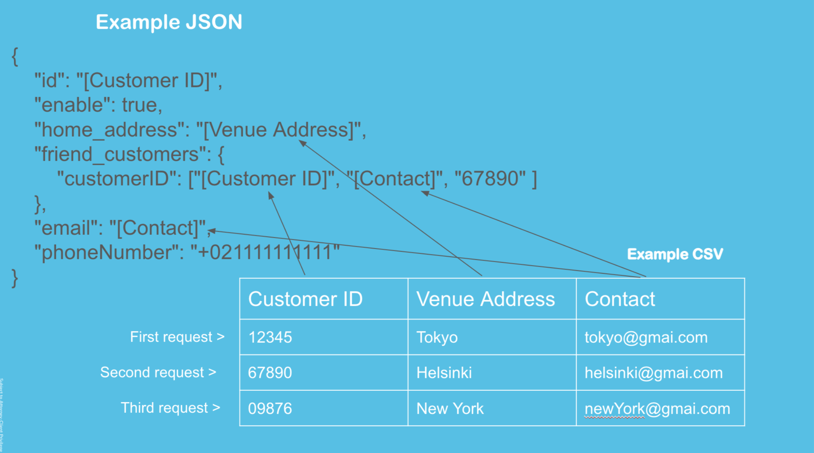

## ~ step by step ~ Expected behavior📝
1. Prepare resource files. (Check out ["What you manually prepare"](https://github.com/hibiki-shibata/bulk-action-for-daily-task-automation/blob/main/README.md#what-you-manually-prepare))
2. Run this Project in CLI.
3. You will be asked for Authorization Token.
4. Bulk request automatically starts.
5. After all request sent without error, you will see message "HEY, DONE❤️".


##


## What you manually prepare -> Only edit ./Resource folder 📝:

1. Edit [`./resource/config.ts`](https://github.com/hibiki-shibata/bulk-action-for-daily-task-automation/blob/main/resource/config.ts)...Configure Request method, URI, CSV column name🔧.
   - Inspect request format(Request URL, Request Method, Request Body) in network log on your Browser, and copy it.

2. Edit [JSON file](https://github.com/hibiki-shibata/bulk-action-for-daily-task-automation/blob/main/resource/requestBody-config.json)....Define the structure of request body📝.
   - Copy the inspected request Body in the step1.
   - Use [<Your CSV column name>]
   
3. Edit [CSV file](https://github.com/hibiki-shibata/bulk-action-for-daily-task-automation/blob/main/resource/custom-values.csv)....Define the target values of request📝.

4. Edit [Access token](https://github.com/hibiki-shibata/bulk-action-for-daily-task-automation/blob/main/resource/access-token.txt)....Paste your access token for the website.


<p align="center" border="none">
  
</p>


#### Optional‼️
4. [authorizationHeaderAndBodyJsonService.ts](https://github.com/hibiki-shibata/bulk-action-for-daily-task-automation/blob/main/src/service/headerAuthorizationBodyJsonService.ts) or [authorizationHeaderAndNoBodyService.ts](https://github.com/hibiki-shibata/bulk-action-for-daily-task-automation/blob/main/src/service/authorizationHeaderAndNoBodyService.ts).....Let's easily chage pattern of Bulk Actions!
- When your requirement wasn't satisfied by the default behavior, custmize more details here!
- It will be simple!

##


##   How to run this Project📚:
#### Prerequisite:
1. Install Node.js (Download from [Node.js official](https://nodejs.org/en/download))
2. Install dependencies by command.
    ```bash 
    npm install
    ```
    
    Run the project by command🔥
    ```bash
    npm start
    ```
